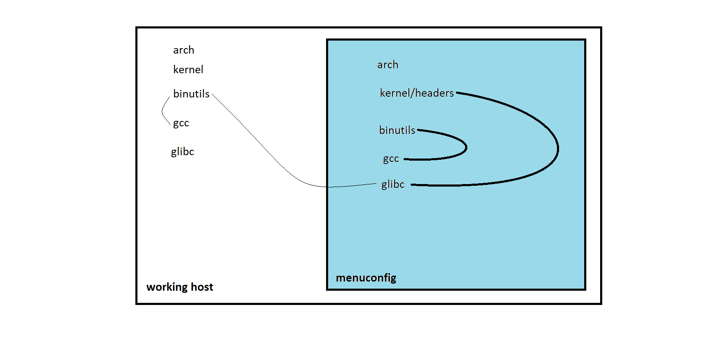

### 出现的情况

如前面所说，as和ld版本检查不通过，于是重新编译安装老版本的binutils，尝试了 2.13.2.1a，2.14， 2.15， 2.16， 2.17 这些大版本号，2.17在configure阶段加参数即可安装成功，2.16经过适当修改(根据报错信息修改文件，make和make install期间都需要修改)， 这两个版本可以安装；而剩下的三个版本都会出现很多问题没有安装成功。

结果在尝试使用2.17版本的binutils继续构建时，版本检查还是不通过！

并且，更为重要的是使用2.17版本的binutils后，在尝试重新开始构建时，gcc不能与它一起工作！！！

尝试过在Centos5上编译安装2.13版本的binutils(成功)，然后将安装目录打包传至Centos7上，显然这样做gcc更不能工作。

### 问题

- **更换工作主机的gcc版本**为更老的版本，以适应之前安装的老版本的binutils？

- 在老版本的发行版上构建？比如以 Centos5/SUSE10 为工作环境 ? 

- 因为gcc和binutils关系极为密切，所以要求实现的目标—gcc版本较新以支持特定的语言标准，同时binutils版本足够旧以通过glibc的版本检查—不会很简单

- 难道思路错了？检查的as，ld是工作主机的，还是配置项中的？

  ​

